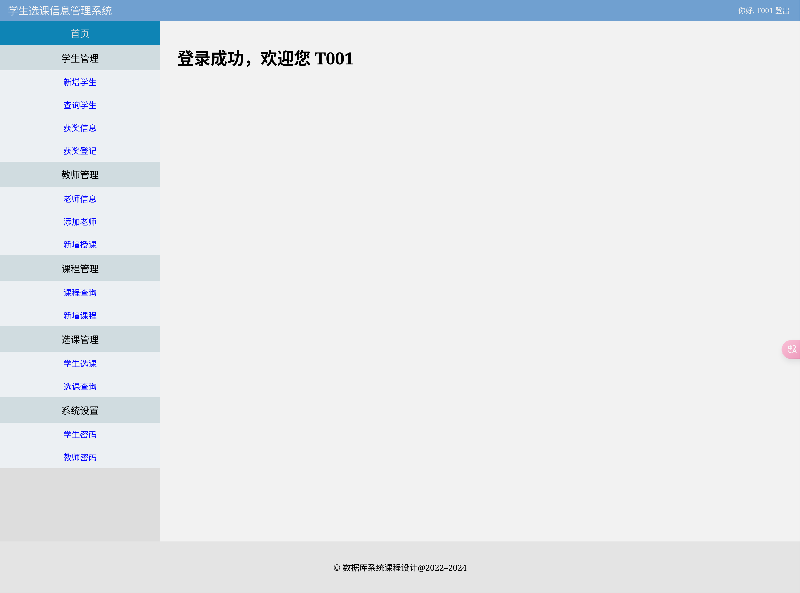
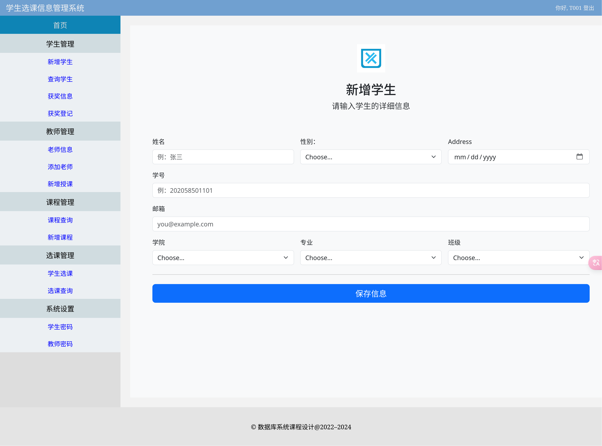
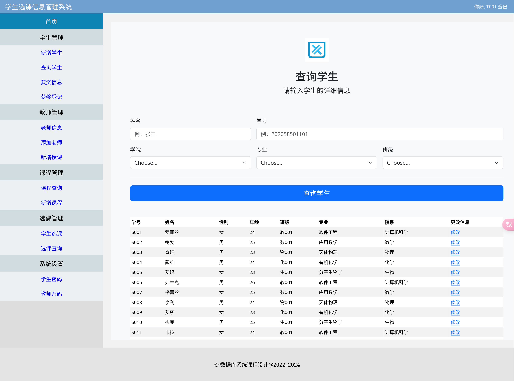
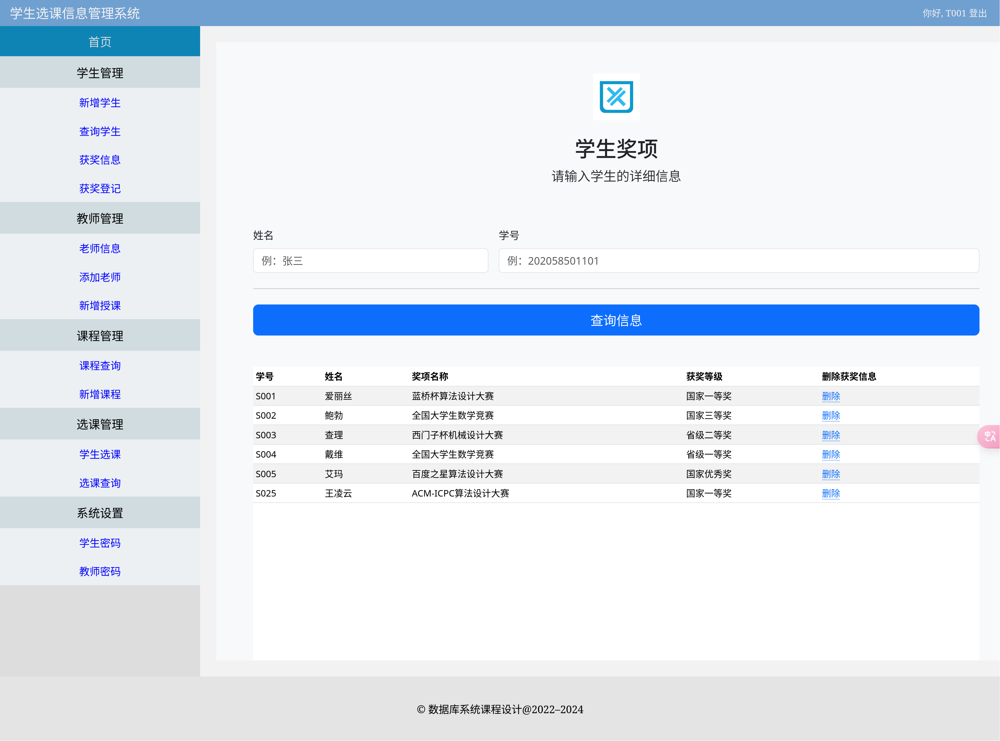
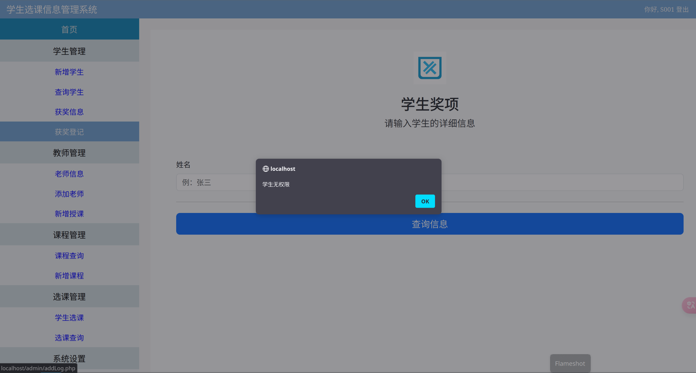

# SmsDB_PHP

本项目为数据库课程设计，小组作业，又可称大作业、 presentation，是一种多人合作完成任务的新型教育模式，广泛应用于大学课堂。区别于普通团队合作1+1>2的模式，小组作业往往可以创新性地达到1+1+1+1＜1的惊人效果。

## 功能介绍：

主要实现了对于学生和老师的管理，以下为主要功能：

### 学生管理

- 添加学生，输入全部的学生信息，点击提交即可添加新的学生==学生无法使用==
- 查询学生，输入要搜索的信息，可以进行模糊搜素
- 查询结果后面带有修改学生信息选项==学生无法使用==
- 查询以及增加和删除学生获奖信息
  1. 输入信息点击查询按钮即可查询学生信息
  2. 查询结果后面带有修改选项，点击修改即可修改学生获奖信息==学生无法使用==
  3. 点击新增即可增加学生获奖信息==学生无法使用==

### 教师管理

- 查询老师，输入教师姓名等详细信息，即可模糊搜索教师信息，包括教师编号，姓名，所在院系。
- 查询教师发表期刊信息，输入教师姓名，编号，即可查看教师发表的论文名及其对应期刊名
- 添加教师，输入教师详细信息即可添加教师 ==学生无法使用==
- 添加授课，一个老师不能重复教同一门课==学生无法使用==

### 课程管理

- 查询课程，可以根据课程名和教学老师搜索课程
- 添加课程，填入课程详细信息添加课程 ==学生无法使用==

### 学生选课

- 学生选课，输入学生学号和课程名及授课老师可选课
- 查询学生选课以及对应的成绩
- 查询结果后链接可修改选课信息（增加或者查询后修改）==学生无法使用==

### 系统设置

- 修改学生密码（输入账号后输入新密码即可修改密码，不需要对照原密码） ==学生无法使用==
- 修改教师密码（需要对照原密码） ==学生无法使用==

## 建表

### 建表语句

注意：其中相同的老师课程号

```sql
CREATE TABLE dept (
    Dno VARCHAR(10) PRIMARY KEY,
    Dname VARCHAR(30) NOT NULL
);

CREATE TABLE major (
    Mno VARCHAR(10) PRIMARY KEY,
    Mname VARCHAR(30) NOT NULL,
    Dno VARCHAR(10),
    FOREIGN KEY (Dno) REFERENCES dept(Dno)
);

CREATE TABLE classes (
    Clsno VARCHAR(10) PRIMARY KEY,
    clsname VARCHAR(10) NOT NULL,
    Clssize INT,
    Mno VARCHAR(10),
    FOREIGN KEY (Mno) REFERENCES major(Mno)
);

CREATE TABLE student (
    Sno VARCHAR(12) PRIMARY KEY,
    Sname VARCHAR(10) NOT NULL,
    Ssex VARCHAR(1) NOT NULL,
    Sdate DATE,
    Semail VARCHAR(30),
    Dno VARCHAR(10),
    Mno varchar(10),
    Clsno VARCHAR(10),
    Spassword VARCHAR(18) NOT NULL,
    FOREIGN KEY (Dno) REFERENCES dept(Dno),
    FOREIGN KEY (Mno) REFERENCES major(Mno),
    FOREIGN KEY (Clsno) REFERENCES classes(Clsno)
);

CREATE TABLE course (
    Cno VARCHAR(6) PRIMARY KEY,
    Cname VARCHAR(15) NOT NULL,
    Ccredit DECIMAL(2,1) NOT NULL
);

CREATE TABLE teacher (
    Tno VARCHAR(10) PRIMARY KEY,
    Tpassword VARCHAR(18) NOT NULL,
    Tname VARCHAR(30) NOT NULL,
    Dno VARCHAR(10),
    FOREIGN KEY (Dno) REFERENCES dept(Dno)
);

CREATE TABLE giveLessons (
    Cno VARCHAR(6),
    Tno VARCHAR(10),
    startDate DATE,
    PRIMARY KEY (Cno, Tno),
    FOREIGN KEY (Cno) REFERENCES course(Cno),
    FOREIGN KEY (Tno) REFERENCES teacher(Tno)
);

CREATE TABLE electives (
    Eno INT PRIMARY KEY AUTO_INCREMENT,
    Cno VARCHAR(6),
    Sno VARCHAR(12),
    Tno VARCHAR(12),
    grade INT,
    FOREIGN KEY (Cno) REFERENCES course(Cno),
    FOREIGN KEY (Sno) REFERENCES student(Sno),
    FOREIGN KEY (Tno) REFERENCES teacher(Tno)
);

CREATE TABLE honors (
    Honid INT PRIMARY KEY AUTO_INCREMENT,
    Honname VARCHAR(30) NOT NULL
);

CREATE TABLE awd (
    Awdid INT PRIMARY KEY AUTO_INCREMENT,
    Awdname VARCHAR(30) NOT NULL,
    Honid INT,
    Sno VARCHAR(12),
    FOREIGN KEY (Sno) REFERENCES student(Sno),
    FOREIGN KEY (Honid) REFERENCES honors(Honid)
);

CREATE TABLE sci (
    sciId INT PRIMARY KEY AUTO_INCREMENT,
    scino VARCHAR(30) NOT NULL
);

CREATE TABLE public (
    pubId INT PRIMARY KEY AUTO_INCREMENT,
    pubName VARCHAR(30) NOT NULL,
    Tno VARCHAR(10),
    sciId INT,
    FOREIGN KEY (Tno) REFERENCES teacher(Tno),
    FOREIGN KEY (sciId) REFERENCES sci(sciId)
);
```

### e-r图

```mermaid
erDiagram
    course["课程"] {
        varchar(6) Cno "课程编号 主键"
        varchar(15) Cname "课程名"
        numeric(2-1) Ccredit "学分值"
    }
    giveLessons["<授课>"] {
        varchar(6) Cno "课程编号 外键"
        varchar(10) Tno "教师编号 外键"
        date startDate "开课日期"
    }
    teacher["教师"] {
        varchar(10) Tno "教师编号"
        varchar(18) Tpassword "账号密码" 
        varchar(30) Tname "教师姓名"
        varchar(10) Dno "系编号 外键"
    }
    dept["学院"] {
        varchar(10) Dno "系编号 主键"
        varchar(30) Dname "系名"
    }
    major["专业"] {
        varchar(10) Mno "专业编号"
        varchar(30) Mname "专业名"
        varchar(10) Dno "系编号 外键"
    }
    classes["班级"] {
        varchar(10) Clsno "班级编号 主键"
        varchar(10) clsname "班级名"
        int Clssize "班级人数"
        varchar(10) Mno "专业编号 外键"
    }
    student["学生"] {
        varchar(12) Sno "学号"
        varchar(10) Sname "姓名"
        varchar(1) Ssex "性别"
        date Sdate "出生日期"
        varchar(30) Semail "电子邮件"
        varchar(10) Dno "所在系"
        varchar(10) Mno "所在专业"
        varchar(10) Clsno "所在班"
    }
    electives["<选修>"] {
        varchar(6) Cno "课程编号 外键"
        varchar Tno "教师编号 外键"
        varchar(12) Sno "学号 外键"
        int grade "考试得分"
    }
    awd["获奖"] {
        int Awdid "获奖编号 主键"
        varchar(30) Awdname "奖项等级"
        int Honid "奖项编号 外键"
        int Sid "学生编号 外键"
    }
    honors["奖项"] {
        int Honid "奖项编号 主键"
        varchar Honname "奖项名称"
    }
    public["发表"] {
        int pubId "发表编号 主键"
        int sciId "期刊编号 外键"
        varchar pubName "论文名称"
        int sciId "期刊编号 外键"
        varchar(10) Tno "教师编号 外键"
    }
    sci["期刊"] {
        int sciId "期刊编号"
        varchar(30) scino "期刊名称"
    }
    course }|--|{ giveLessons : "多对多" 
    giveLessons }|--|{ teacher : "多对一"
    teacher ||--|{ public : "一对多"
    public }|--|{ sci : "多对多"
    teacher }|--|| dept : "一对多"
    student }|--|| classes : "多对一"
    student ||--|{ major : "一对多"
    student ||--|{ dept : "一对多"
    classes }|--|| major : "多对一"
    major }|--|| dept : "多对一"
    course }|--|| electives : "多对一"
    electives }|--|{ student : "多对多"
    student ||--|{ awd : "一对多"
    awd }|--|| honors : "多对一"
    teacher ||--|{ electives : "一对多"
```

### 插入测试数据

```sql
--dept
INSERT INTO dept (Dno, Dname) VALUES
('D001', '计算机科学'),
('D002', '数学'),
('D003', '物理'),
('D004', '化学'),
('D005', '生物');

--major
INSERT INTO major (Mno, Mname, Dno) VALUES
('M001', '软件工程', 'D001'),
('M002', '应用数学', 'D002'),
('M003', '天体物理', 'D003'),
('M004', '有机化学', 'D004'),
('M005', '分子生物学', 'D005');

--classes
INSERT INTO classes (Clsno, clsname, Clssize, Mno) VALUES
('C001', '软001', 30, 'M001'),
('C002', '数001', 25, 'M002'),
('C003', '物001', 20, 'M003'),
('C004', '化001', 35, 'M004'),
('C005', '生001', 28, 'M005');

--student
INSERT INTO student (Sno, Sname, Ssex, Sdate, Semail, Dno, Mno, Clsno, Spassword) VALUES
('S001', '爱丽丝', '女', '2000-01-01', 'alice@example.com', 'D001', 'M001', 'C001', 'S001'),
('S002', '鲍勃', '男', '1999-02-15', 'bob@example.com', 'D002', 'M002', 'C002', 'S002'),
('S003', '查理', '男', '2001-03-20', 'charlie@example.com', 'D003', 'M003', 'C003', 'S003'),
('S004', '戴维', '男', '2000-05-22', 'david@example.com', 'D004', 'M004', 'C004', 'S004'),
('S005', '艾玛', '女', '2001-07-30', 'emma@example.com', 'D005', 'M005', 'C005', 'S005'),
('S006', '弗兰克', '男', '1998-11-12', 'frank@example.com', 'D001', 'M001', 'C001', 'S006'),
('S007', '格蕾丝', '女', '1999-04-05', 'grace@example.com', 'D002', 'M002', 'C002', 'S007'),
('S008', '亨利', '男', '2000-06-18', 'henry@example.com', 'D003', 'M003', 'C003', 'S008'),
('S009', '艾莎', '女', '2001-08-25', 'elsa@example.com', 'D004', 'M004', 'C004', 'S009'),
('S010', '杰克', '男', '1999-09-30', 'jack@example.com', 'D005', 'M005', 'C005', 'S010'),
('S011', '卡拉', '女', '2000-12-14', 'kara@example.com', 'D001', 'M001', 'C001', 'S011'),
('S012', '李', '男', '1998-10-08', 'li@example.com', 'D002', 'M002', 'C002', 'S012'),
('S013', '玛丽亚', '女', '2001-01-22', 'maria@example.com', 'D003', 'M003', 'C003', 'S013'),
('S014', '尼克', '男', '2000-03-14', 'nick@example.com', 'D004', 'M004', 'C004', 'S014'),
('S015', '奥莉维亚', '女', '1999-02-19', 'olivia@example.com', 'D005', 'M005', 'C005', 'S015');

--course
INSERT INTO course (Cno, Cname, Ccredit) VALUES
('C101', '数据库系统', 3.0),
('C102', '微积分', 4.0),
('C103', '量子力学', 3.5),
('C104', '有机化学', 3.0),
('C105', '分子生物学', 4.0);

--teacher
INSERT INTO teacher (Tno, Tpassword, Tname, Dno) VALUES
('T001', 'T001', '史密斯博士', 'D001'),
('T002', 'T002', '约翰逊博士', 'D002'),
('T003', 'T003', '威廉姆斯博士', 'D003'),
('T004', 'T004', '戴维斯博士', 'D004'),
('T005', 'T005', '威尔逊博士', 'D005');

--giveLessons
INSERT INTO giveLessons (Cno, Tno, startDate) VALUES
('C101', 'T001', '2023-09-01'),
('C102', 'T002', '2023-09-01'),
('C103', 'T003', '2023-09-01'),
('C104', 'T004', '2023-09-01'),
('C105', 'T005', '2023-09-01');

--electives
INSERT INTO electives (Cno, Sno, Tno, grade) VALUES
('C101', 'S001', 'T001', 95),
('C102', 'S002', 'T002', 88),
('C103', 'S003', 'T003', 92),
('C104', 'S004', 'T004', 85),
('C105', 'S005', 'T005', 90),
('C101', 'S006', 'T001', 87),
('C102', 'S007', 'T002', 93),
('C103', 'S008', 'T003', 91),
('C104', 'S009', 'T004', 89),
('C105', 'S010', 'T005', 84),
('C101', 'S011', 'T001', 96),
('C102', 'S012', 'T002', 85),
('C103', 'S013', 'T003', 94),
('C104', 'S014', 'T004', 90),
('C105', 'S015', 'T005', 88);

--honors
INSERT INTO honors (Honname) VALUES
('全国大学生数学竞赛'),
('蓝桥杯算法设计大赛'),
('西门子杯机械设计大赛'),
('ACM-ICPC算法设计大赛'),
('百度之星算法设计大赛');

--awd
INSERT INTO awd (Awdname, Honid, Sno) VALUES
('国家一等奖', 2, 'S001'),
('国家三等奖', 1, 'S002'),
('省级二等奖', 3, 'S003'),
('省级一等奖', 1, 'S004'),
('国家优秀奖', 1, 'S005');

--sci
INSERT INTO sci (scino) VALUES
('SCI001'),
('SCI002'),
('SCI003'),
('SCI004'),
('SCI005');

--public
INSERT INTO public (pubName, Tno, sciId) VALUES
('数据库研究', 'T001', 1),
('数学模型', 'T002', 2),
('量子理论', 'T003', 3),
('化学反应', 'T004', 4),
('生物工程', 'T005', 5);
```

## 基本界面

### 登陆界面


### 主界面



### 增加信息界面（以新增学生为例）



### 查询界面（以查询学生为例）



### 修改界面（以修改学生信息为例）


### 删除界面（以删除学生奖项为例）



### 权限管理（以学生无法登记奖项为例）


